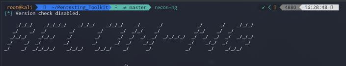

# Recon-ng

> Comes standard with Kali Linux \(full\) or available here: https://github.com/lanmaster53/recon-ng  
> If not included in your version of Kali, the easiest and most up-to-date way to get it is via: **`apt update && apt install recon-ng`**

Since version 5, no modules come standard with recon-ng, so your first step will be to pull them all from the marketplace.  So to list available modules, run `marketplace search` . The syntax to use recon-ng is just different enough from Metasploit to elicit a couple grunts of frustration every time you open it and misfire a command.  However, to counterbalance this, it supports auto-completion with `[tab]`, unlike almost every tool available to the hacker.  Some of the modules depend on API keys that are no longer free or may depend on a service that no longer exists, so you may be more picky with installing specific modules to avoid non-functional ones, but as an American, I like my options to bubble and overflow out of my terminal, regardless of their practicality.  Therefore, without regret or a second thought, my next command would be `marketplace install all`

  
unbeliavable  


\`\`

